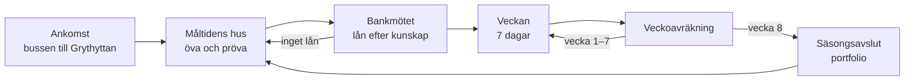

# Nexus – speldesign version 1

2026-09-25 · Vision Owner

Nexus version 1 är en sommarsäsong i Grythyttan: åtta spelveckor där spelaren lär sig i Måltidens hus, lånar på sin kunskap och driver en verksamhet som växer med det hon visat att hon kan. Dokumentet är styrande för ORDER 100 och för ordern till Claude Code. Alla 25 beslut från beslutsdokumentet är godkända av Vision Owner 2026-09-25.

## Spelslingan

Spelet har en stor slinga, säsongen, och en liten, veckan. Kunskap är det enda som följer med genom allt. Kassan kan gå förlorad, kunskapen kan det inte.



Förebilden är *Hades* och *Rogue Legacy*: ett försök kan gå dåligt, men det du lärt dig följer med och gör nästa försök bättre. Det är samma tanke som schemats ”ingen kunskap = inget lån, gå och öva”, och det gör misslyckande till en del av lärandet i stället för ett straff.

Spelaren kan alltid gå tillbaka till Måltidens hus. Paviljongerna är en övningsslinga, inte en introduktion man passerar en gång.

## Tiden

En säsong är åtta veckor, från midsommar till kräftskiva. En genomspelning tar omkring åtta timmar, en timme per spelvecka. Förebilden är *Stardew Valley*: en tydlig dagsrytm, en vecka med båge och en säsong med högtider som man ser fram emot.

**Dagen** har tre faser:

| Fas | Vad spelaren gör | Tid i verkligheten |
| --- | --- | --- |
| Morgon | Fyller två platser i dagens schema: en satsning (personalfest, utbildning, ekologiska råvaror) eller ett besök i en paviljong. Beställer råvaror och sätter menyn | 2–3 min |
| Service | Kvällen spelas. Gästerna kommer efter veckodag och säsong. Spelaren kan rycka in med action-knappen | 4–5 min |
| Kväll | Kvällsberättelsen visar vad som hände och varför. Quizen efter servicen erbjuds | 1–2 min |

**Veckan** har sex servicedagar och en söndag. Måndag är lugn, fredag och lördag är tunga. Söndagen är stängd: veckoavräkningen görs, golvet betalas ut, lånet amorteras, och spelaren har fyra schemaplatser i stället för två. Söndagen är alltså veckans stora övningsdag.

**Säsongen** har en högtid varannan vecka som ändrar gästflödet och ger en egen händelse i Kalastorget:

| Vecka | Högtid | Effekt |
| --- | --- | --- |
| 1 | Midsommar | Hög efterfrågan på lunch och dryck |
| 3 | Grythyttedagarna | Festival i Kalastorget, många turister |
| 5 | Vinprovning i Stensöta | Gäster som frågar om vin, gynnar vinbaren |
| 8 | Kräftskiva | Säsongens sista och största kväll |

Midsommar och kräftskiva är fasta. Veckorna 3 och 5 är förslag som kan bytas mot riktiga evenemang i Grythyttan.

## Kunskapen

Kunskap mäts på två sätt. **Medaljer** per paviljong visar vilken nivå spelaren har bevisat, och styr banken och golvet. **Krediter** per axel (episteme, techne, fronesis) samlas av varje rätt svar och bildar kunskapsprofilen som bankmötet och portfolion läser.

### Paviljongerna

| Paviljong | Axel | Spår | Vem ställer frågan |
| --- | --- | --- | --- |
| Måltidsbiblioteket | episteme | – | Bibliotekarien |
| Metodköket | techne | kök | Köksmästaren |
| Stensöta | techne | sommellerie | Sommelieren |
| Kalastorget | fronesis | – | En gäst eller kollega i en situation |
| Gastronomiska Teatern | alla tre | kök och sommellerie | Två av de andra tillsammans |

Alla paviljonger är öppna från start utom Teatern, som öppnas när spelaren har silver i två paviljonger. Teaterns frågor kombinerar två områden, till exempel en rätt och dess vin.

### Öva och pröva

Ett besök i en paviljong kostar en schemaplats och är ett av två val:

- **Öva.** Fem frågor med förklaring efter varje svar. Ger krediter men ingen medalj. Förebilden är *Duolingo*: repetition som känns som framsteg.
- **Prov.** Åtta frågor dras ur nivåns tio, i slumpvis ordning. Sex rätt ger medaljen. Ett omprov drar på nytt. För att pröva en nivå krävs medaljen på nivån under.

Förklaringen efter varje svar är det viktigaste i hela kunskapssystemet. Den gör ett fel svar till något spelaren lär sig av.

### Medaljerna

Brons, silver, guld och platina per paviljong. En medalj som är tagen behålls alltid, som ett gymmärke i *Pokémon*: ett bevis som öppnar vägar och aldrig kan tas tillbaka. Platina är taket. Den som når platina får en belöning i verksamheten, till exempel en signaturrätt i Metodköket eller en egen vinlista i Stensöta.

### Quizen efter servicen

Efter varje kväll erbjuds tre frågor från kvällens svagaste axel, den som låg bakom flest problem i kvällsberättelsen. Rätt svar ger en kredit, fel svar kostar en. Spelaren kan hoppa över quizen utan kostnad, men får då inget. Quizen är ett erbjudande, inte ett avbrott.

### Frågebanken

Frågorna är data, inte kod. Varje fråga har paviljong, nivå, vem som ställer den, frågetext, fyra alternativ, rätt svar och förklaring. Vision Owner levererar frågorna. Tills de finns används bronsbankens 40 frågor på alla nivåer, tydligt märkta som platshållare.

## Ekonomin

Kunskap är golvet under ekonomin. Ju mer spelaren kan, desto mindre kan en dålig vecka skada och desto större del av marknaden kan hon ta. Kassa och krediter byter aldrig plats: kunskap kan inte köpas, och pengar kan inte bli kunskap.

### Golvet

Varje medaljnivå har ett värde: ingen 0, brons 15, silver 30, guld 55, platina 90. Varje klass har en huvudpaviljong (se klasserna). Golvprocenten räknas så här:

```
G = 0,6 × huvudpaviljongens värde + 0,4 × snittet av övriga paviljonger
```

G kan aldrig bli högre än 90. Veckogolvet är G procent av klassens normala veckointäkt. Om veckans intäkt blir lägre än golvet fylls mellanskillnaden på vid veckoavräkningen. Samma belopp är också spelarens kreditram för satsningar under veckan. Alla paviljonger bidrar alltså, men huvudpaviljongen väger mest.

### Lånet

Bankmötet ger ett startlån som täcker lokal och inventarier för klassen. Lånet amorteras lika under säsongens åtta veckor, med fem procents ränta. Bankens besked formuleras som en diagnos i ord, aldrig som siffror: vad spelaren visat att hon kan och vad som saknas för nästa klass.

### Marknaden

Varje dag har Grythyttan en gästpool som följer veckodag, säsong och högtid. Poolen delas mellan spelaren och ortens krogar efter attraktivitet. Spelarens andel har ett tak som växer med kunskapen: 20 % plus 3 procentenheter per medaljsteg, där brons är ett steg och platina fyra. Förebilden är *Two Point Hospital*, där ryktet drar folk men kapaciteten sätter gränsen.

### Slumpen

En enskild kväll får gå riktigt illa även för en duktig spelare. Över en vecka ska den bättre förberedda spelaren vinna ungefär tre veckor av fyra. Förebilden är *Slay the Spire*: slumpen avgör enskilda strider, skickligheten avgör resultatet över tid. Målet mäts med 1 000 simulerade veckor och fast fröslump.

### Nedgradering

Om kassan är under noll vid tre dagsavslut i rad, nedgraderas spelaren vid nästa veckoavräkning. Lokalen säljs, resten av lånet skrivs ner, och spelaren går ner en klass: gästgiveri eller nattklubb till restaurang, restaurang till vinbar eller ölkrog efter spelarens medaljer, vinbar eller ölkrog till food truck, food truck till inget lån. Kunskapen följer alltid med. Spelaren får två dagars varning i kvällsberättelsen innan det händer.

## Verksamhetsklasserna

Sex klasser, och varje klass är ett eget spel, inte en storlek. Klasserna skiljer sig i gästlogik, kök och vad som går fel. Startvalet mellan vinbar och ölkrog styrs av vad spelaren har valt att lära sig.

| Klass | Platser | Huvudpaviljong | Krav | Särdrag | Byggs som nr |
| --- | --- | --- | --- | --- | --- |
| Vinbar | 20 | Stensöta | Brons i tre, varav Stensöta | Smårätter, lounger, DJ, vinlista | 1 |
| Food truck | kö | Spelarens bästa | Brons i en | Lucka mot gatan, kö, väder, gatuläge, snabb omsättning | 2 |
| Restaurang | 60 | Metodköket | Silver i tre | Matsal och bar, mise en place, flera rätter | 3 |
| Ölkrog | 20 | Metodköket | Brons i tre, varav Metodköket | Bryggeri i lokalen, rejäl mat, få rätter | 4 |
| Gästgiveri | 100 | Kalastorget | Guld i tre, varav Kalastorget. Endast uppgradering | Övernattning, frukost, soignée servering, dygnsstruktur | 5 |
| Nattklubb | 150 | Kalastorget | Guld i Kalastorget och silver i Stensöta. Endast uppgradering | Flera barer, dans, volym och flöde, sena kvällar | 6 |

Utan någon brons blir bankens besked inget lån: gå och öva.

### Uppgradering

Vid varje veckoavräkning kan spelaren byta till en klass vars krav hon uppfyller, om kassan räcker till en veckas golv i den nya klassen. Kunskapen följer med, personalen får följa med, och ryktet halveras eftersom gästerna inte känner den nya lokalen. Spelaren kan också frivilligt gå ner en klass vid veckoavräkningen, utan att först ha gått under.

Förebilden är *Two Point Hospital* och *Game Dev Tycoon*: att flytta till större lokal är en milstolpe man arbetar mot och som känns i spelet, men den är också en risk.

## Servicen

Servicen är slumpen, viktad av spelarens förberedelser. Det spelaren gjort på morgonen, och det hon kan, avgör hur ofta saker går rätt. Hon ser konsekvenserna i rummet, inte i siffertavlor.

### Satsningarna

Morgonens satsningar påverkar de tre kapitalen: ekonomiskt, socialt och ekologiskt. Personalfest och utbildning gör personalen lojal och minskar misstag. Ekologiska råvaror höjer kvaliteten men kostar mer. Ingen satsning är alltid rätt, bara bättre eller sämre för veckan som kommer. Det finns ingen optimal strategi, bara avvägningar, precis som ORDER 100 kräver.

### Action-knappen

Spelaren kan rycka in själv. Hon väljer en uppgift ur kön, till exempel att ta en beställning, bära ut en rätt eller lugna en gäst som väntat länge, och hennes figur utför den. Insatsen går snabbare ju fler techne-krediter hon har. Under tiden ser hon inte resten av rummet i tjugo spelsekunder, så hon kan missa något annat.

Högst tre insatser per kväll. En lyckad insats, som en gäst som stannar i stället för att gå, ger en techne-kredit. Förebilden är *Overcooked*: det roliga är att vara i stressen, inte att titta på den.

### Ryktet

Ryktet kan inte gå under 10 av 100. Det återhämtar sig långsamt av sig självt och snabbare genom händelser: ett bord som stannar kvar, en lyckad rekommendation, en kväll utan returer. Varje återhämtning nämns i händelseströmmen, till exempel ”bordet vid fönstret beställde en flaska till”. En siffra som stiger är en mätare, en gäst som stannar är en berättelse.

### Lagret

Spelaren får öppna med för lite råvaror. Före öppning visas en prognos i ord, till exempel ”råvaror till ungefär elva kuvert”. Ett medvetet dåligt beslut är både roligt och lärorikt. Att bli stoppad är det inte.

### Händelser

Händelser uppstår ur simuleringen, inte ur en kortlek. Dålig hygien leder till inspektion, gott rykte till en recensent, svag kassa till ett samtal från banken. Varje händelse har en orsak som kvällsberättelsen kan peka på.

### Medgång

Kvällsberättelsen börjar med det som gick bra, och först därefter det som gick fel. Personalens känslor som saknar avläsare, som `proud`, tas bort. Glädjen i spelet ska komma från kunskap som syns i verksamheten, från räddade kvällar och från medaljer, inte från fler röda varningar.

## Professionell mognad och portfolio

Medaljerna visar vad spelaren vet och kan. Mognadssteget visar hur hon använder det. Varje steg kräver både medaljer och evidens från verksamheten, så att omdöme belönas och inte bara rätta svar.

| Steg | Medaljer | Evidens från verksamheten |
| --- | --- | --- |
| Novis | – | Spelets början |
| Praktiker | Brons i tre | En hel vecka utan att kassan gått under noll |
| Reflekterande praktiker | Silver i tre | Quizen efter servicen tagen tio kvällar, och den svagaste axeln förbättrad |
| Professionell | Guld i tre | Två veckor i rad över golvet utan påfyllnad, och fem kvällar vända med action-knappen |
| Expert | Platina i två och guld i Kalastorget | En vecka där alla tre kapitalen ökade |

Expert kräver Kalastorget eftersom fronesis, omdömet, är den högsta formen av yrkeskunskap enligt ORDER 100.

### Portfolion

Portfolion fylls i automatiskt av det spelaren gör, aldrig av henne själv. Varje rad är evidens, inte omdöme, till exempel ”Vände sex kvällar där gäster var på väg att gå” eller ”Höll personalen kvar genom en vecka med negativ kassa”. Den visas vid säsongsavslutet och kan öppnas när som helst från menyn.

Förebilden är karriärstegen i *The Sims*: en titel man vill nå, med tydliga krav som går att arbeta mot.

## Ramar för version 1

### Introduktionen

Spelet börjar med bussen till Grythyttan i förstaperson (VS001). En mentor från Campus möter spelaren och följer henne genom första dagen: ett övningsbesök, ett prov och bankmötet. Målet är att en ny spelare står i sin första verksamhet inom 20 minuter. Mentorn försvinner sedan och dyker bara upp igen om spelaren nedgraderas. Första veckan har färre gäster än resten av säsongen, så att spelaren hinner lära sig rummet.

### Sparande

Spelet sparas automatiskt vid varje dagsavslut. Varje veckoavräkning sparas dessutom som en egen kopia, så att spelaren kan gå tillbaka en vecka. Tre sparplatser per spelare.

### Veckoavräkningen

Veckoavräkningen visas som söndagsnumret av en lokaltidning i Grythyttan. Den har en recension av veckans bästa eller sämsta kväll, hur det gick på marknaden, vad banken säger och vilken högtid som kommer. Tidningen gör siffrorna till en berättelse och håller spelet fritt från stat-paneler.

### Språk och målgrupp

Spelet är på svenska i version 1. Frågorna skrivs med spelartext och metadata separerade, så att engelska kan läggas till senare. Bronsbanken har i dag spelartext på engelska. Claude översätter den som utkast, och Vision Owner granskar.

Målgruppen är studenter och blivande studenter i måltidskunskap. Brons ska gå att klara för en intresserad lekman som har övat, platina ska kräva yrkeskunskap.

### Utanför version 1

Följande ur ORDER 100 byggs inte i version 1: NPC:er med egna liv, byggnader som byter funktion, andra årstider än sommar, flera spelare och export av forskningsdata. De är inte bortvalda, bara senare.

## Principer för spelglädje och lärande

Varje ny funktion ska klara de här sju principerna. Den som inte gör det hör inte hemma i version 1.

1. **Kunskap syns i verksamheten.** Det spelaren lärt sig ska märkas i rummet samma vecka, inte bara i en profil.
2. **Misslyckande lär.** Varje dålig kväll har en orsak som kvällsberättelsen kan peka på, och varje fel svar har en förklaring.
3. **Det finns alltid en väg tillbaka.** Medaljer förloras aldrig, nedgradering är inte slutet, och paviljongerna är alltid öppna.
4. **Val, inte optimering.** Ingen satsning, klass eller paviljong är alltid rätt. Spelet belönar avvägningar.
5. **Närvaro framför åskådande.** Spelaren ska kunna ingripa när det gäller, men insatsen har ett pris.
6. **Berättelse framför siffror.** Resultat visas som händelser, repliker och tidningstext, aldrig som stat-paneler.
7. **Något att se fram emot.** Nästa medalj, nästa klass, nästa högtid. Det ska alltid finnas ett mål som ligger en eller två dagar bort och ett som ligger veckor bort.

Den sjunde principen är den som får spelaren att fortsätta. Den är lånad från *Stardew Valley* och *Animal Crossing*: små mål varje dag, stora mål varje säsong.
