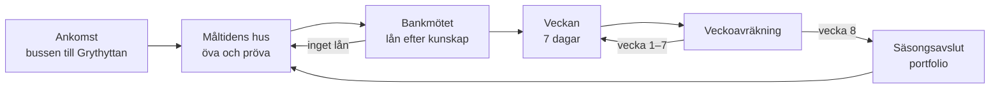

# Nexus – speldesign version 1

2026-09-25 · Vision Owner

Nexus version 1 är en sommarsäsong i Grythyttan: åtta spelveckor där spelaren lär sig i Måltidens hus, lånar på sin kunskap och driver en verksamhet som växer med det hon visat att hon kan. Dokumentet är styrande för ORDER 100 och för ordern till Claude Code. Alla 25 beslut från beslutsdokumentet är godkända av Vision Owner 2026-09-25.

## Spelslingan

Spelet har en stor slinga, säsongen, och en liten, veckan. Kunskap är det enda som följer med genom allt. Kassan kan gå förlorad, kunskapen kan det inte.


```mermaid
flowchart LR
  A["Ankomst<br/>bussen till Grythyttan"] --> B["Måltidens hus<br/>öva och pröva"]
  B --> C["Bankmötet<br/>lån efter kunskap"]
  C -->|inget lån| B
  C --> D["Veckan<br/>7 dagar"]
  D --> E["Veckoavräkning"]
  E -->|vecka 1–7| D
  E -->|vecka 8| F["Säsongsavslut<br/>portfolio"]
  F --> B
```

Förebilden är *Hades* och *Rogue Legacy*: ett försök kan gå dåligt, men det du lärt dig följer med och gör nästa försök bättre. Det är samma tanke som schemats ”ingen kunskap = inget lån, gå och öva”, och det gör misslyckande till en del av lärandet i stället för ett straff.

Spelaren kan alltid gå tillbaka till Måltidens hus. Paviljongerna är en övningsslinga, inte en introduktion man passerar en gång.

## Kärnan

*Beslut 2026-10-02 (Vision Owner, efter provspelet samma dag).*

Betygen var: spänning 2, följd 2, rummet mekaniskt, byn 1 och vilja att spela igen 1. Spelets kärna saknar handling, risk och belöning.

Kärnan byggs före byn i kvällsljus. Därefter kommer butiken mellan kvällarna, där krediter och medaljer köper förmågor (stegen mot stjärnan), och sedan byn i kvällsljus.

1. **Hovmästarens beslut under hela servicen.**
   - Spelaren väljer vilket sällskap i kön som får bord.
   - Spelaren kan bjuda en gäst som väntat för länge.
   - Spelaren kan sälja in en flaska.
   - Spelaren kan flytta personal dit det brinner.
   - När det är fullt kommer ett beslut med några sekunders mellanrum.
   - Raketerna kommer ur händelserna i rummet, utan taket på tre per kväll.
2. **Risk.**
   - Startkapitalet sänks kraftigt, och banklånet står kvar.
   - Banken sätter ett veckomål.
   - Missas målet två veckor i rad omförhandlas lånet.
   - Efter tre veckor under golvet stängs krogen och säsongen är slut.
3. **Följder per gästtyp, synliga.**
   - En missnöjd gäst med socialt kapital syns gå till en rival i byn, och ger avbokningar nästa morgon.
   - Recensenten skriver i tidningen.
   - Ryktet syns i HUD:en och ändras under kvällen.
4. **Konkurrens i realtid.**
   - Ett band i HUD:en visar kvällens gäster per krog. Det uppdateras när en grupp väljer krog.
   - Grupper som väljer en rival syns på gatan.
5. **Mise en place efter inköpen.**
   - Förberedelsen växer med inköpen och de bokade gästerna.
   - Personalen hinner en viss mängd före öppning.
   - Det som inte hinns görs under servicen och fördröjer gästerna.
   - Spelaren kan ta in en extra hand på morgonen.
6. **Fel som rättas.**
   - Tallrikarna ska stå där gästerna sitter, inte på tomma bord.
   - DJ:n som spelaren betalat för ska synas.
   - Vid förlust står det "Dras från kontot", inte "För över".
   - Spelet får inte öppna utan råvaror utan att stoppa och fråga.
   - Ringarna får en förklaring (etiketten vid hovring) eller tas bort.

**Talen** (startkapital, veckomål, mise en place-tid) föreslås av Claude Code och prövas i harness. Målet är att en rimlig spelare klarar säsongen och att en slarvig riskerar att stänga. Förslaget rapporteras innan punkt 1–5 byggs.

*Beslut 2026-10-02 (Vision Owner, efter förslaget om talen):* talen godkänns som utgångsläge: bara ränta under säsongen, veckomål i intäkt, dubbel ränta vid omförhandling, stängning efter tre veckoavräkningar under noll, och mise en place enligt förslaget. Startkassan sänks kraftigt. Felsvar ska kosta mindre, och ryktet ska hålla över veckan för en rimlig spelare. Målet är en jämn trappa: mentorns spelare stänger aldrig, den rimliga nästan aldrig, den som har hälften rätt i 30–50 % av säsongerna och den som alltid svarar fel nästan alltid. DJ och springare ska löna sig när de används klokt (DJ en fullbokad fredag eller lördag, springare vid stor bokning), men inte när de används varje kväll. Talen låses efter harnessen.

*Beslut 2026-10-07 (Vision Owner, provspelet):* efter det första bokslutet under noll säger Banken: "Kassan är under noll. Två bokslut till i rad, så stänger krogen." Efter det andra: "Ett bokslut till under noll, så stänger vi."

*Beslut 2026-10-02 (Vision Owner, Designs leverans hovmästaren och butiken):* när tiden på en nål går ut väljer Per det säkra svaret, som aldrig går fel men sällan ger mest, och servicen stannar aldrig. Köpta förmågor behålls. Facket bestämmer vad som gäller nästa kväll; det har två platser i början och fler vid stjärnan. Jämförelsen med byn efter kvällen är en egen skärm före butiken. Medaljer öppnar förmågor och förbrukas inte; krediter betalar.

*Beslut 2026-10-02 (Vision Owner, efter harnessen med fem spelare):* den dolda regeln att låg kassa vänder bort gäster i dörren tas bort. Startkapitalet kalibreras så att den som har hälften rätt stänger i 30–50 % av säsongerna, och talen låses. Stjärnan kräver guld i Gastronomiska Teatern, högt rykte och gott serviceomdöme två veckor i rad; den delas ut i söndagstidningen, kan förloras om nivån sjunker under en vecka, och ger facket en tredje plats. Raketerna utlöses av det som händer i rummet (de fem händelserna, incidenterna, gästernas situationer), oftare när det är fullt och utan tak per kväll. Det som begränsas till tre per kväll är att satsa krediter (Stå för ditt svar); knappen visar antalet satsningar som är kvar. Harnessen får en spelare som väljer klokt på nålarna och i butiken och en som låter Per välja allt; skillnaden ska märkas men inte vara avgörande. Flytta personal (figuren går dit, med den streckade ringen) väntar till efter provspelet.

## Tiden

En säsong är åtta veckor, från midsommar till kräftskiva. En genomspelning tar omkring åtta timmar, en timme per spelvecka. Förebilden är *Stardew Valley*: en tydlig dagsrytm, en vecka med båge och en säsong med högtider som man ser fram emot.

**Dagen** har tre faser:

| Fas | Vad spelaren gör | Tid i verkligheten |
| --- | --- | --- |
| Morgon | Fyller två platser i dagens schema: en satsning (personalfest, utbildning, ekologiska råvaror) eller ett besök i en paviljong. Beställer råvaror och sätter menyn | 2–3 min |
| Service | Kvällen spelas. Gästerna kommer efter veckodag och säsong. Spelaren svarar på kvällens händelser | 4–5 min |
| Kväll | Kvällsberättelsen visar vad som hände och varför. Kvällens lärdom förklarar de fel beslut spelaren tog | 1–2 min |

**Veckan** har sex servicedagar och en söndag. Måndag är lugn, fredag och lördag är tunga. Söndagen är stängd: veckoavräkningen görs, golvet betalas ut, lånet amorteras, och spelaren har fyra schemaplatser i stället för två. Söndagen är alltså veckans stora övningsdag.

**Säsongen** har en högtid varannan vecka som ändrar gästflödet och ger en egen händelse i Kalastorget:

| Vecka | Högtid | Effekt |
| --- | --- | --- |
| 1 | Midsommar | Hög efterfrågan på lunch och dryck |
| 3 | Grythyttedagarna | Festival i Kalastorget, många turister |
| 5 | Vinprovning i Stensöta | Gäster som frågar om vin, gynnar vinbaren |
| 8 | Kräftskiva | Säsongens sista och största kväll |

Midsommar och kräftskiva är fasta. Veckorna 3 och 5 är förslag som kan bytas mot riktiga evenemang i Grythyttan.

*Beslut 2026-09-28 (Vision Owner, efter provspel):* tiden kvar av servicen syns hela kvällen.

*Beslut 2026-09-28 (Vision Owner, andra provspelet):* klockan för servicen ska synas tydligt. Den kontrolleras när resten av spelet går över till engelska.

## Kunskapen

Kunskap mäts på två sätt. **Medaljer** per paviljong visar vilken nivå spelaren har bevisat, och styr banken och golvet. **Krediter** per axel (episteme, techne, fronesis) samlas av varje rätt svar och bildar kunskapsprofilen som bankmötet och portfolion läser.

*Beslut 2026-10-04 (Anders): kunskapsgrunden.* `documentation/foundation/KUNSKAPSGRUND_TRIAD.md` står över alla tidigare beskrivningar av kunskapsformerna i spelet.
- **Formerna.** Episteme (att veta), phronesis (att bedöma) och techne (att göra) kommer från Aristoteles. Urvalet, tolkningen och operationaliseringen är TRIAD-modellen, utvecklad av Anders Crichton-Fock (tidigare Herdenstam).
- **Det dubbla greppet** är Crichton-Focks begrepp: att hålla analys och upplevelse samtidigt, och handla.
- **Namnet.** Spelet påstår aldrig att Aristoteles definierade formerna så som spelet använder dem. Namnet skrivs "Crichton-Fock (tidigare Herdenstam)" första gången på en skärm och därefter "Crichton-Fock". Ingen text citerar "Herdenstam" ensamt.
- **Källorna** står på sidan Kunskapsgrunden i Måltidsbiblioteket och i eftertexterna.
- **Paviljongernas register** följer filens avsnitt om Måltidens hus:
  - Måltidsbiblioteket är det analytiska registret;
  - Kalastorget det analogiska;
  - Metodköket och Stensöta abduktion i handling;
  - Gastronomiska Teatern är platsen för det dubbla greppet.
- **Raketen med analys, upplevelse och handling** och halvt grepp (filens avsnitt om raketen) beslutas efter ett förslag i rapporten om kunskapsgrunden (`documentation/architecture/`).

*Beslut 2026-10-05 (Anders): raketen följer det dubbla greppet.* Förslaget i rapporten om kunskapsgrunden gäller i sin helhet.
- **Ordningen** är analys → upplevelse → handling: episteme, phronesis, techne. Pyramiden har handlingen i toppen. Omdömet har som förut mest tid.
- **Ledtrådarna.** Steg ett och två är frågor som besvaras, en analytisk ledtråd och en analogisk ur situationen, så att krediterna per kunskapsform finns kvar. Ledtråden står kvar på kortet när handlingen väljs.
- **Fel på steg ett eller två** avslutar raketen, som förut.
- **Handlingen** har svar märkta med grepp: helt, halvt mot analysen, halvt mot upplevelsen, eller fel. Ett halvt grepp klarar raketen med halva effekten och en återkoppling som säger vilket register som saknades.
- **Portfolion** sparar varje rakets grepp.
- **Innehållet:** ett urval på tio raketer skrivs först och prövas, innan resten skrivs om.

*Beslut 2026-10-08 (Anders, situationerna i vinbaren):* elva av vinbarens situationer står i formen analys → upplevelse → handling, med gästens replik i upplevelsen, ledtrådarna och svaren i blandad ordning; Karaffen är ny. Ett fel på vägen avslutar inte situationen: stegets följd gäller, potten nollas och ledtråden blir oklar. Ett svar i handlingen kan kosta, och kostnaden syns som ett mynt på svaret innan spelaren väljer; räcker inte kassan syns svaret men går inte att välja. I Karaffen lägger spelaren handgreppen i ordning på korten. Raden bedöms på brister i tekniken och i omsorgen: bara brister i tekniken är halvt grepp där upplevelsen höll, bara brister i omsorgen halvt grepp där analysen höll, och båda sorterna är fel. Går tiden ut innan raden är full tar personalen över. Halvt grepp visas i papper och mässing och aldrig i rött. Karaffen och ljuset står på loungebordet medan situationen pågår, och den tomma flaskan ställs bredvid när den är avgjord.

*Beslut 2026-10-08 (Anders, gissaren och felen i upplevelsen):* det hela greppet i handlingen ska inte gå att känna igen på att det är det längsta svaret; det är längst i högst hälften av situationerna, och den som alltid väljer det längsta svaret ska inte klara sig bättre än slumpen. Ett fel i upplevelsen påverkar bara stämningen och ryktet; det som felet kostar i kassan ligger på felsvaret i handlingen.

*Beslut 2026-10-08 (Anders, hela banken):* i vinbarens alla situationer, också de i den äldre formen och menyns, är det längsta svaret rätt ungefär så ofta som slumpen ger, och den som alltid väljer det längsta svaret tjänar inte mer än slumpen över en vecka. Steget om upplevelsen tar aldrig något ur kassan eller av orken; den följden ligger på felsvaret i handlingen. Texten i spelet gäller före utkasten.

### Paviljongerna

| Paviljong | Axel | Spår | Vem ställer frågan |
| --- | --- | --- | --- |
| Måltidsbiblioteket | episteme | – | Bibliotekarien |
| Metodköket | techne | kök | Köksmästaren |
| Stensöta | techne | sommellerie | Sommelieren |
| Kalastorget | fronesis | – | En gäst eller kollega i en situation |
| Gastronomiska Teatern | alla tre | kök och sommellerie | Två av de andra tillsammans |

Alla paviljonger är öppna från start utom Teatern, som öppnas när spelaren har silver i två paviljonger. Teaterns frågor kombinerar två områden, till exempel en rätt och dess vin.

### Öva och pröva

Ett besök i en paviljong kostar en schemaplats och är ett av två val:

- **Öva.** Fem frågor med förklaring efter varje svar. Ger krediter men ingen medalj. Förebilden är *Duolingo*: repetition som känns som framsteg.
- **Prov.** Åtta frågor dras ur nivåns tio, i slumpvis ordning. Sex rätt ger medaljen. Ett omprov drar på nytt. För att pröva en nivå krävs medaljen på nivån under.

*Beslut 2026-09-27 (Vision Owner):* Måltidens hus är oförändrat när servicen får trestegsraketer (se Servicen, Händelserna i servicen): paviljongerna övar och prövar var sin kunskapsform. Proven är på tid, 30 sekunder per fråga. Hinner spelaren inte svara räknas det som fel. Övningen är utan tid och visar förklaringen.

Förklaringen efter varje svar är det viktigaste i hela kunskapssystemet. Den gör ett fel svar till något spelaren lär sig av.

### Medaljerna

Brons, silver, guld och platina per paviljong. En medalj som är tagen behålls alltid, som ett gymmärke i *Pokémon*: ett bevis som öppnar vägar och aldrig kan tas tillbaka. Platina är taket. Den som når platina får en belöning i verksamheten, till exempel en signaturrätt i Metodköket eller en egen vinlista i Stensöta.

### Quizen efter servicen

*Beslut 2026-09-26 (Vision Owner, efter provspel):* quizen efter servicen ersätts av **kvällens lärdom**: förklaringen till de fel beslut spelaren tog i kvällens händelser (se Servicen, Händelserna i servicen). Texten nedan gäller inte längre.

Efter varje kväll erbjuds tre frågor från kvällens svagaste axel, den som låg bakom flest problem i kvällsberättelsen. Rätt svar ger en kredit, fel svar kostar en. Spelaren kan hoppa över quizen utan kostnad, men får då inget. Quizen är ett erbjudande, inte ett avbrott.

### Frågebanken

Frågorna är data, inte kod. Varje fråga har paviljong, nivå, vem som ställer den, frågetext, fyra alternativ, rätt svar och förklaring.

*Beslut 2026-09-27 (Vision Owner):* frågebanken och händelsebanken har fältet referens (titel och länk), som visas med förklaringen när det finns. Fälten är tomma tills vidare. Vision Owner levererar referenserna och kunskapen bakom frågorna senare. Inga länkar hittas på.
 Vision Owner levererar frågorna. Tills de finns används bronsbankens 40 frågor på alla nivåer, tydligt märkta som platshållare.

## Ekonomin

Kunskap är golvet under ekonomin. Ju mer spelaren kan, desto mindre kan en dålig vecka skada och desto större del av marknaden kan hon ta. Kassa och krediter byter aldrig plats: kunskap kan inte köpas, och pengar kan inte bli kunskap.

### Golvet

Varje medaljnivå har ett värde: ingen 0, brons 15, silver 30, guld 55, platina 90. Varje klass har en huvudpaviljong (se klasserna). Golvprocenten räknas så här:

```
G = 0,6 × huvudpaviljongens värde + 0,4 × snittet av övriga paviljonger
```

G kan aldrig bli högre än 90. Veckogolvet är G procent av klassens normala veckointäkt. Om veckans intäkt blir lägre än golvet fylls mellanskillnaden på vid veckoavräkningen. Samma belopp är också spelarens kreditram för satsningar under veckan. Alla paviljonger bidrar alltså, men huvudpaviljongen väger mest.

### Hyran och lönerna

*Beslut 2026-09-29 (Vision Owner):* trycket i ekonomin kommer från de fasta kostnaderna.
- Varje klass har en veckohyra. Den dras vid veckoavräkningen och står i söndagstidningen.
- Lönerna visas som en veckorad i avräkningen, även om de dras varje servicedag.
- Hyran kalibreras så att den rimliga spelaren går plus med ungefär 5–10 % av veckointäkten, och den svaga spelaren nedgraderas inom två till tre veckor. Slumpmålet mäts om.

*Beslut 2026-09-29 (Vision Owner, efter rapporterna om felen och kvällens resultat):* hyran ändras inte nu. Den rimliga spelaren mäts med fler frön, minst 20, och mätningen rapporteras innan hyran rörs.

*Beslut 2026-10-01 (Vision Owner, efter rättelserna från provspelet):* hyran ändras inte nu, fast den rimliga spelaren går plus med mer än målet. Vinsten kalibreras när rivalerna delar gästerna.

*Beslut 2026-10-05 (Anders):* den som har hälften rätt ska stänga i ungefär en tredjedel till hälften av säsongerna, och spaken väljs fritt. Säsongens fyra första veckor har ingen hyra, i stället för den lägre hyran de två första veckorna. Startkassan står kvar, enligt beslutet att den sänks kraftigt. Rätt svar ger inte längre avec, merförsäljning när stämningen lyfter, eller en gäst per klarat steg. En klarad raket släpper fortfarande in en gäst.

*Beslut 2026-09-30 (Vision Owner, provspel): kvällens ekonomi gör kvällen spännande.*
- Under servicen visas kvällskassan, inte företagskontot. Den börjar på noll och visar kvällens intäkter.
- När dörrarna öppnas visas kvällens insats: råvaror, personal, DJ, satsningar och kompetens. Kvällskassan fylls mot en synlig linje för break-even, så att spelaren ser om kvällen går mot vinst eller förlust.
- Efter servicen visas täckningsbidrag, täckningsgrad och kvällens resultat. Resultatet förs till företagskontot, eller dras från det vid förlust, och det syns som en överföring.
- En prognos säger hur många veckor spelaren klarar sig med konceptet, räknad på de senaste kvällarna och de fasta kostnaderna.

*Beslut 2026-09-30 (Vision Owner, efter kvällens ekonomi):* insatsen visas med Designs fyra rader (råvaror, personal, DJ, kompetens), och satsningar som egen rad när spelaren valt någon. DJ och satsningar dras från kassan på morgonen när de väljs, och de räknas in i linjen för kvällens insats.

*Beslut 2026-09-30 (Vision Owner, provspelet av kvällens ekonomi): kurser är investeringar, inte kvällens kostnader.* Kvällens insats räknar bara råvaror, personal, DJ och kvällens satsningar. Kurserna, det laget lär sig (utbildningen av salen och vinprovningen med laget), dras från kassan när de väljs men står utanför kvällens resultat. De redovisas som investering i veckoavräkningen. Kvällens resultat är ett tal, räknat på ett sätt, och står likadant efter servicen, i kvällens resultat och i kassan.

### Lånet

Bankmötet ger ett startlån som täcker lokal och inventarier för klassen. Lånet amorteras lika under säsongens åtta veckor, med fem procents ränta. Bankens besked formuleras som en diagnos i ord, aldrig som siffror: vad spelaren visat att hon kan och vad som saknas för nästa klass.

*Beslut 2026-09-26 (Vision Owner):* efter inget lån ger banken nytt lån först efter en hel vecka i Måltidens hus med minst ett prov.

*Beslut 2026-09-27 (Vision Owner):* utan verksamhet och utan pengar visas en tydlig ruta mitt på skärmen. Den enda vägen vidare är till Måltidens hus för att öva och göra prov, så att banken kan ge lån. Inga andra knappar.

### Marknaden

Varje dag har Grythyttan en gästpool som följer veckodag, säsong och högtid. Poolen delas mellan spelaren och ortens krogar efter attraktivitet. Spelarens andel har ett tak som växer med kunskapen: 20 % plus 3 procentenheter per medaljsteg, där brons är ett steg och platina fyra. Förebilden är *Two Point Hospital*, där ryktet drar folk men kapaciteten sätter gränsen.

### Byn

*Beslut 2026-09-29 (Vision Owner, tredje provspelet):* förslaget om rivalerna byggs som byn.
- Spelaren ser vilka krogar som har öppet, deras mat och priser, och gästflödet på gatorna.
- Efter kvällen jämförs spelarens gäster och intäkt per stol med de andra krogarnas.
- Spelaren kan zooma ut över byn och planera nästa kväll.

*Beslut 2026-09-30 (Vision Owner, provspel):* en knapp och en tangent zoomar ut till byn och tillbaka. Kvällens by görs ljusare, så att man ser gäster på väg mot krogen. Byns text (zoomnivåerna, kartkrediten) syns inte under servicen.

### Slumpen

En enskild kväll får gå riktigt illa även för en duktig spelare. Över en vecka ska den bättre förberedda spelaren vinna ungefär tre veckor av fyra. Förebilden är *Slay the Spire*: slumpen avgör enskilda strider, skickligheten avgör resultatet över tid. Målet mäts med 1 000 simulerade veckor och fast fröslump.

*Beslut 2026-09-26 (Vision Owner):* mätningen spelar som spelaren, och svarar på scenarierna vid dörren. Den har två spelare: en rimlig, som väljer det svar en duktig spelare väljer, och en svag, som väljer sämsta svaret och handlar för lite till lagret. Nedgraderingen och vägen tillbaka prövas med den svaga spelaren, som sedan byter till rimligt spel.

### Nedgradering

Om kassan är under minus veckogolvet vid tre dagsavslut i rad, nedgraderas spelaren vid nästa veckoavräkning. Lokalen säljs, resten av lånet skrivs ner, och spelaren går ner en klass: gästgiveri eller nattklubb till restaurang, restaurang till vinbar eller ölkrog efter spelarens medaljer, vinbar eller ölkrog till food truck, food truck till inget lån. Kunskapen följer alltid med. Spelaren får två dagars varning i kvällsberättelsen innan det händer.

*Beslut 2026-09-26 (Vision Owner), så att det alltid finns en väg tillbaka:*
- Nedgradering räknas först när kassan är under minus veckogolvet tre dagsavslut i rad. Golvet är kreditram.
- Löner dras bara på servicedagar, efter kvällens intäkt. Söndag ingen lön.
- Vid tvingad nedgradering säljs lokalen för 50 % av inventarievärdet, som blir startkassa i den nya klassen.

## Verksamhetsklasserna

Sex klasser, och varje klass är ett eget spel, inte en storlek. Klasserna skiljer sig i gästlogik, kök och vad som går fel. Startvalet mellan vinbar och ölkrog styrs av vad spelaren har valt att lära sig.

| Klass | Platser | Huvudpaviljong | Krav | Särdrag | Byggs som nr |
| --- | --- | --- | --- | --- | --- |
| Vinbar | 20 | Stensöta | Brons i tre, varav Stensöta | Smårätter, lounger, DJ, vinlista | 1 |
| Food truck | kö | Spelarens bästa | Brons i en | Lucka mot gatan, kö, väder, gatuläge, snabb omsättning | 2 |
| Restaurang | 60 | Metodköket | Silver i tre | Matsal och bar, mise en place, flera rätter | 3 |
| Ölkrog | 20 | Metodköket | Brons i tre, varav Metodköket | Bryggeri i lokalen, rejäl mat, få rätter | 4 |
| Gästgiveri | 100 | Kalastorget | Guld i tre, varav Kalastorget. Endast uppgradering | Övernattning, frukost, soignée servering, dygnsstruktur | 5 |
| Nattklubb | 150 | Kalastorget | Guld i Kalastorget och silver i Stensöta. Endast uppgradering | Flera barer, dans, volym och flöde, sena kvällar | 6 |

Utan någon brons blir bankens besked inget lån: gå och öva.

*Beslut 2026-10-05 (Anders): konceptet och varukorgen.* Förslaget om konceptet och varukorgen i `documentation/blueprints/` gäller i sin helhet.
- Konceptet (enkel, bistro, soigné) är en egen dimension ovanpå verksamhetsklassen och räknas fram ur morgonens varukorg.
- Gränserna och priset per gäst i förslaget är starttal som kalibreras i harness.
- Gästtyperna blir fem: studenter, bybor, turister, gourmeter och affärsfolk. Turisterna är en egen typ också utanför bussen.
- Krogen har ett rykte, och varje koncept har dessutom sitt eget.
- Leverantörernas och utrustningens priser och villkor i förslaget är starttal.
- Frågorna förankras i första hand i Gusto Science-biblioteket och i etablerade referensverk. Anders granskar dem och väljer källorna.

*Beslut 2026-10-01 (Vision Owner, efter rättelserna från provspelet): vinbaren är det enda första valet tills food trucken är byggd i etapp 6.* Banken erbjuder vinbaren oavsett vilken paviljong spelaren tog brons i. Food trucken saknar ännu sin plats i byn och sina raketer.

### Uppgradering

Vid varje veckoavräkning kan spelaren byta till en klass vars krav hon uppfyller, om kassan räcker till kontantinsatsen: 25 % av en veckas golv i den nya klassen, resten lånas (beslut 2026-09-26, Vision Owner). Kunskapen följer med, personalen får följa med, och ryktet halveras eftersom gästerna inte känner den nya lokalen. Spelaren kan också frivilligt gå ner en klass vid veckoavräkningen, utan att först ha gått under.

Förebilden är *Two Point Hospital* och *Game Dev Tycoon*: att flytta till större lokal är en milstolpe man arbetar mot och som känns i spelet, men den är också en risk.

*Beslut 2026-10-07 (Vision Owner, om Designs D7):* ryktet följer med oförändrat när spelaren tar över nästa steg. Ombyggnaden från vinbar till bistro tar tre dagar, och erbjudandekortet säger det i förväg: "Bistron håller stängt 3 kvällar under ombyggnaden". Bistrons möblering i husets mått godkänns som den är byggd, och DJ-hörnet blir en musikhörna med skivspelare. Foodtrucken visas på krogens nivå i 3D, nära den egna vagnen, med luckan, grillen, kön, ståborden och vagnens klipp.

*Beslut 2026-10-07 (Vision Owner, kalibreringen):* den som har hälften rätt ska stänga i 30–50 % av säsongerna, med möjligheten att stanna i foodtrucken eller vinbaren. Stjärnan för den som har 0,75 rätt kalibreras mot 10–25 % av säsongerna.

*Beslut 2026-10-07 (Vision Owner, kalibreringen i foodtrucken):* erbjudandet om vinbaren kräver minst sex klarade situationer i foodtrucken (halvt grepp räknas som en halv) och kommer tidigast efter tio kvällar i foodtrucken. Ryktet i foodtrucken återhämtar sig som i resten av spelet. Den som har hälften rätt når aldrig bistron och får aldrig stjärnan; att stanna i foodtrucken är godkänt, och målet att stänga i 30–50 % av säsongerna utgår. Att den som har 0,6 rätt når vinbaren i 14 av 40 säsonger och den med 0,75 får stjärnan i 2–3 av 40 godtas som brus.

*Beslut 2026-10-07 (Vision Owner, liv vid foodtrucken):* ingen gäst får uppstå eller försvinna i bild; gästerna kommer gående från byns gator och går därifrån till en gata eller ett hus, och ingen skapas eller tas bort inom kamerans bild eller närmare än 40 m från vagnen. Föremål tonas in och ut i stället för att byta på en gång. En situation utlöses av något som syns, som en gäst som går fram till luckan och pekar, regn eller en leverans; kortet kommer inte ur tomma intet. Målet är 4–6 situationer per kväll.

*Beslut 2026-10-07 (Vision Owner, foodtruckens frågor):* de 15 frågorna utan ⚖ (med fråga 21) grupperas i fem situationer i ordningen episteme → phronesis → techne, och ⚖-frågorna ligger i egna situationer som är dolda tills de är granskade. Ett ⚖-märke ska aldrig dölja frågor utan ⚖. Fler situationer i foodtrucken kommer från Claude som en egen leverans och läggs in utan ny kod.

*Beslut 2026-10-08 (Vision Owner, de nyfikna och trängseln):* klicket på en nyfiken gäst vid foodtrucken öppnar frågekortet med en fråga ur foodtruckens bank, inte prototypens exempel, och svaret avgör utfallet: rätt ställer sig i kön, nästan tvekar och står kvar, fel går vidare. Ingen gäst eller personal kommer närmare en annan än 0,35 m i någon verksamhet. Vid vagnen väjer man, håller till höger och knuffas isär; i vinbaren och bistron väjer man och knuffas isär. Kortets sekunder, kögränsen för marschallerna och blicken på klockan står i balance.ts.

*Beslut 2026-10-08 (Vision Owner, kunskapen vid luckan):* vagnens kapacitet ökas inte, eftersom det är verkligt att en foodtruck har en gräns. Kunskapen syns i stället i att köpet blir större, att gästen kommer tillbaka en senare kväll som stamgäst och att ryktet stiger. Mer kapacitet kan bli en satsning som spelaren köper, som en andra grill. De nyfikna har egna frågor i gästens röst, och frågan väljs efter vad gästen gör i bild: läser skylten, luktar på röken, fryser, ser på priset eller kommer med barn. Frågor om livsmedelssäkerhet är märkta ⚖ och dolda tills de är granskade. Medhjälparen vid luckan heter inte Elin, som finns i vinbaren.

*Beslut 2026-10-08 (Vision Owner, vagnens meny):* vagnen har vegokorv, grillad på en egen del av grillen med egen tång, mild senap bredvid den skånska, ketchup och kaffe, på menyn och skylten. De nyfiknas svar ska stämma med vagnen: den grillar på gas, och skånsk senap är sötstark, så ett barn får den milda senapen eller ketchup. Den andra grillen som satsning väntar. Vännen till en gäst som svarat rätt kommer gående från byn.

*Beslut 2026-10-07 (Vision Owner, platsen och vädret vid vagnen):* vagnen har en uteservering med ståbord, en bänk, marschaller och en värmare. De som äter står vid borden, torkar sig med servetten och slänger den i sopkorgen innan de går; när det är mycket folk blir skräp kvar på borden, och medhjälparen städar när kön är kort, annars spelaren. Vädret är ett per kväll och syns på morgonen. Sol ger fler förbipasserande, regn färre och gästerna äter under markisen, blåsten tar servetterna och en sval kväll samlas gästerna kring värmaren och de nyfikna frågar om kylan. Medhjälparen tänder marschallerna och luckan står tom så länge, så medhjälparen väntar när kön är lång.

*Beslut 2026-10-08 (Vision Owner, situationerna vid vagnen):* foodtrucken har sex situationer till i formen analys, upplevelse och handling: regnet, getingen, kortläsaren, korven som tar slut, hunden och Grillvagnen som sänker priset. Var och en utlöses av något som syns i bild innan kortet kommer. Samma situation kommer inte två kvällar i rad om det finns andra att välja. I hundens situation döljs bara lagtexten tills den är granskad. Talen i räkneuppgifterna står i balance.ts: halv special 35 kr, inköpet 12 kr och Grillvagnens nya pris 25 kr; korven tar slut när 12 finns kvar och 9 står i kön. Vegokorv, mild senap och kaffe står på skylten.

## Servicen

Servicen är slumpen, viktad av spelarens förberedelser. Det spelaren gjort på morgonen, och det hon kan, avgör hur ofta saker går rätt. Hon ser konsekvenserna i rummet, inte i siffertavlor.

*Beslut 2026-10-01 (Vision Owner, provspel: "spelaren tittar mest på, kunskapens följder syns inte, och varje kväll är likadan"): följden syns.*
- **Insatsen före svaret.** Raketkortet visar vad som står på spel i kronor och gäster, till exempel bordets nota och att två av gästerna är stamgäster.
- **Följden efter svaret, i rummet och i kassan.** Rätt svar ger en synlig händelse: gästen beställer mer, beloppet flyger till kvällskassan och stapeln hoppar. Fel svar ger en tom stol, ett belopp som försvinner och en gäst som går.
- **Kameran glider in vid alla raketer.**
- **Rusningar.** Gäster i sällskap kommer i vågor (bilarna från Örebro och Karlstad, bussen). En kö bildas vid dörren, tålamodet sjunker, och spelaren väljer vem som får bord först.
- **Följder nästa dag.** Bokningsboken visar vad gårdagens svar gav, till exempel bokningar tack vare gårdagens vin.
- **Personalen står aldrig still.** Före öppning gör de mise en place med de klipp som finns, tills Design levererar nya.
- **Kassan står still efter servicen**, från stängningen till nästa morgon.

*Beslut 2026-10-01 (Vision Owner): ordningen efter följden.* Först rivalerna och food truckarna som styrs av datorn (på olika platser i byn, med eget namn, mat, pris och rykte), aviseringar när en grupp kommer till byn med gruppen synlig på kartan, och jämförelsen efter kvällen. Sedan veckomålen, stjärnan och stegen mot den, dagens läge och stamgäster med namn. Rivalerna byggs så att en rival senare kan vara en människa.

*Beslut 2026-09-26 (Vision Owner): kunskapen verkar i servicen.* Medaljerna verkar per medaljsteg, där brons är ett steg och platina fyra:
- **Metodköket** sänker köksmisstagen och risken att kvällen faller ihop, med 10 % per steg.
- **Stensöta** höjer intäkten per gäst via dryck, med 10 % per steg.
- **Kalastorget** gör att klagande gäster oftare stannar: gästen i kön tål 10 sekunder längre per steg och ger upp först vid lägre nöjdhet. Med medaljer i Kalastorget ger också scenariots bästa svar mer, 25 % per steg.
- **Huvudpaviljongen** styr personalens tempo: uppgifterna går 5 % fortare per steg.
- **Krediterna** från övning och quiz fyller rummets förutsättningar i samma register och sänks aldrig.

Slumpmålet mäts med scenarierna inräknade, och den bättre förberedda spelaren skiljer sig bara i medaljer. Målet är att hon vinner mellan 70 och 80 % av veckorna.

### Satsningarna

Morgonens satsningar påverkar de tre kapitalen: ekonomiskt, socialt och ekologiskt. Personalfest och utbildning gör personalen lojal och minskar misstag. Ekologiska råvaror höjer kvaliteten men kostar mer. Ingen satsning är alltid rätt, bara bättre eller sämre för veckan som kommer. Det finns ingen optimal strategi, bara avvägningar, precis som ORDER 100 kräver.

*Beslut 2026-10-01 (Vision Owner): satsningarna ska löna sig när de används klokt.* En DJ lönar sig när det är fullt en fredag eller lördag, en springare när bokningen är stor. I dag ger de förlust varje gång. Ett förslag till balans prövas i harnessen och granskas av Vision Owner innan något ändras.

### Händelserna i servicen

*Beslut 2026-09-26 (Vision Owner, efter provspel): servicen görs om. Action-knappen tas bort.*

- Servicen blir en följd av händelser: 3–6 per kväll, fler fredag och lördag, i en båge med öppning, rusning, kris och avslut.
- Varje händelse är en kort berättelse i kvällens sammanhang (bord, gäst, rätt, personal) med 3–4 svar och 20 sekunders nedräkning. Uteblir svaret beslutar personalen själv, med sämre utfall och −1 kredit.
- Varje händelse hör till en paviljong och en axel. Medaljer i den paviljongen ger mer tid eller stryker ett fel alternativ.
- Varje svar ger direkt effekt: synligt i rummet och i tre mätare, kassa, gästernas nöjdhet och personalens ork. Mätarna är ett medvetet undantag från regeln om stat-paneler (princip 6).
- Händelser kan kedjas: ett val kan utlösa eller förhindra en senare händelse samma kväll.
- Dagens scenarier vid dörren flyttar in som händelser. Quizen efter servicen ersätts av kvällens lärdom: förklaringen till de fel beslut spelaren tog.
- Händelsebanken är data, som frågebanken. Varje händelse har paviljong, axel, svar med utfall och kedjor.
- Harnessen svarar på händelserna som rimlig och svag spelare, och slumpmålet mäts om.

*Beslut 2026-09-27 (Vision Owner, efter provspel):*
- Rummet står inte still. Servicen fortsätter medan nedräkningen går, så att väntan syns.
- Fel val låser. Följden av ett fel svar pågår synligt i rummet tills nästa händelse, och svaret går inte att ändra.
- Rätt svar kan bero på kvällens läge. Exempel: klockan 20.30 har både tygservetterna och isen tagit slut. Rätt är isen, eftersom kvällen går mot after dinner-drinkar och servetterna kan brytas i morgon bitti. Väljer spelaren servetterna tar isen slut i baren, gästerna får vänta synligt, och nöjdhet och krediter sjunker. Fler händelser ska bero på klockslag och läge.
- En händelse som gäller ett bord kommer bara när en gäst sitter vid bordet.
- Den svaga spelaren ska gå minus över en vecka.

*Beslut 2026-09-27 (Vision Owner): trestegsraketer i servicen.*
- Måltidens hus är oförändrat. Paviljongerna övar och prövar var sin kunskapsform. Provfrågorna har 30 sekunder.
- I servicen är varje händelse en raket med tre frågor i samma sammanhang: **Episteme** (vad, 15 sekunder), **Techne** (hur, 20 sekunder) och **Phronesis** (när och varför, 30 sekunder). Man når nästa steg bara genom att klara det förra.
  *Beslut 2026-09-29 (Vision Owner, tredje provspelet):* raketens tid blir 20 sekunder i varje steg. Det ersätter tiderna per steg.
  *Beslut 2026-09-29 (Vision Owner, efter rapporterna om felen och kvällens resultat):* stegtiderna blir episteme 20 sekunder, techne 20 sekunder och phronesis 30 sekunder. Omdömet ska ha mest tid. Det ersätter 20 sekunder i varje steg och byggs i nästa order.
- Fel svar på ett steg ger stegets konsekvens, och personalen tar över resten med sämre utfall. Hela raketen klarad ger bästa utfall. Konsekvensen syns direkt i rummet och på mätarna.
- Medaljer i den paviljong som hör till stegets axel ger mer tid på just det steget. Episteme hör till Måltidsbiblioteket, Techne till Metodköket eller Stensöta efter händelsens ämne, och Phronesis till Kalastorget.
- 2–4 raketer per kväll, fler fredag och lördag. Rummet fortsätter medan nedräkningen går.
- De 30 utkasten skrivs om till raketer. Gusto.science-skriptet skriver en raket per artikel, med ett steg ur vart och ett av artikelns tre avsnitt.
- Alla tider står i `balance.ts`. Slumpmålet mäts om.

Det här ersätter punkterna ovan om 3–6 händelser per kväll, 20 sekunders nedräkning och en axel per händelse.

*Beslut 2026-09-28 (Vision Owner, efter provspel): raketerna styr gästflödet.* Fler rätta svar ger fler gäster in i lokalen, och de köper mer ur lagret. Vid fel svar tar personalen i rollen över, och resultatet beror på deras kunskap (se Personalen).

*Beslut 2026-09-28 (Vision Owner, andra provspelet): gästerna frågar om kvällens meny.*
- Raketer där gäster frågar om kvällens rätter och drycker, utifrån menyn och dryckeslistan som spelaren satt på morgonen: druvan, fisken, råvarans ursprung.
- Rätt svar ger högre dricks.

*Beslut 2026-09-29 (Vision Owner, Designs leverans kassan och kvällen):* dricksen går till personalens pott och aldrig till kassan. Den syns i händelseströmmen och i kvällens summa.

*Beslut 2026-09-30 (Vision Owner, provspel): följden av svaren syns i rummet.* Rätt svar ger fler gäster som kommer in och högre nota. Fel svar ger färre gäster, lägre nota och missnöjda gäster. Det visas med händelser i rummet, inte med siffror i en lista.

*Beslut 2026-09-30 (Vision Owner, provspel): rätt och fel syns tydligt.* Det ersätter regeln att fel aldrig är rött.
- Rätt: grön glöd, svaret lyfter och kunskapspyramidens våning fylls med en tydlig rörelse uppåt.
- Fel: röd markering, en kort skakning, och våningen spricker eller mörknar.
- Förklaringen efteråt är vänlig som förut. Det är ögonblicket som ska vara tydligt, inte lärdomen som ska straffa.

*Beslut 2026-09-30 (Vision Owner, provspel): kunskapspyramiden.* Raketkortet har en pyramid med episteme i botten, techne i mitten och phronesis i toppen. Varje rätt svar fyller sin våning, och stegets multiplikator syns på våningen. En full pyramid firas. Kvällens resultat visar kvällens pyramider.

### Händelseströmmen

*Beslut 2026-09-28 (Vision Owner, andra provspelet): servicen syns.*
- En händelseström visar i stunden beställningar, betalningar som tickar in, dricks och slumpens händelser.
- Lagret syns under servicen: portioner och flaskor per artikel.
- Det som tar slut ger missnöjda gäster.

### Insatsen

*Beslut 2026-09-28 (Vision Owner, andra provspelet): action-knappen kommer tillbaka som live betting.*
- Spelaren startar själv en trestegsraket och satsar krediter, med vinst och förlust.
- Kassa och krediter tickar upp och ner med tydlig animation.
- Förlusterna ska kunna bli stora, och en dålig vecka ska kunna leda till nedgradering.

*Ersatt 2026-09-29:* tolkningen att insatsens storlek flyttade kassan gäller inte längre.

*Beslut 2026-09-29 (Vision Owner): insatsen görs bara i krediter, och heter Back your knowledge.*
- Kassa och krediter byter aldrig plats. Inget belopp dras från eller läggs till kassan av insatsen. Krediter kan aldrig köpas.
- Spelaren startar själv en raket och väljer för varje steg hur säker hen är på svaret: gissar, tror det eller vet det. Ju säkrare, desto mer vinner hen om svaret stämmer och desto mer förlorar hen om det inte gör det. Steget multiplicerar bara rätt svar: episteme minst, phronesis mest. Ett fel kostar insatsen och avslutar raketen. Går tiden ut räknas det som fel på den lägsta säkerheten.
- Raketens vanliga följder gäller som i servicen: ett rätt svar ger raketens goda följd, ett fel den dåliga.
- Utfallet avgörs bara av svaren. Inga casinodrag: inga hjul, spelautomater, tärningar eller jetonger, och inga ord som betting, gamble eller jackpot.
- Efter kvällen visas hur säker spelaren var och hur ofta det höll, så att den som satsade högt och hade fel ser att hon trodde sig kunna mer än hon kunde.
- Förlusterna och trycket kommer inte längre från insatsen, utan från de fasta kostnaderna (se Ekonomin > Hyran och lönerna).

*Beslut 2026-10-05 (Anders): kvitt eller dubbelt ersätter säkerheten.* Gissar, tror det och vet det, med sin skala och stegens multiplikator, gäller inte längre, varken i Stå för ditt svar eller i de planerade raketerna. Valet att gå vidare är säkerheten.
- Varje rätt steg lägger stegets krediter i raketens pott. Potten håller bara krediter, aldrig kassan.
- Efter ett rätt steg som inte är det sista väljer spelaren: stanna och ta potten, eller gå vidare. Rätt på nästa steg dubblar potten och lägger till stegets kredit. Fel tar hela potten.
- Den som stannar får ingen följd, och personalen tar inte över resten av händelsen.
- Valet har åtta sekunder. När tiden går ut stannar spelaren.
- En raket där spelaren stannar efter andra steget räknas som klarad i stjärnans andel. Efter första steget räknas den inte.
- Ryktet, gästerna som kommer in, dricksen och stämningen följer varje svar som förut.
- Portfolion registrerar valet: gick vidare och hade rätt, gick vidare och hade fel, stannade med rätt.

### Personalen

*Beslut 2026-09-28 (Vision Owner, efter provspel): personal är en investering.*
- Rollerna har olika lön och kunskap, till exempel runner, servitör, sommelier och hovmästare.
- Vid fel svar tar personalen i rollen över, och resultatet beror på deras kunskap.
- En runner är billig men tappar glas och kan inte svara gästerna, och det sänker ryktet.
- Matsalen: runner, servitör, sommelier och hovmästare ersätter värd och servitör. Hovmästaren tar över värdens uppgifter.
- Köket: kocken finns kvar, och lärlingen blir kökets billiga roll, med fler misstag.

*Beslut 2026-09-28 (Vision Owner, andra provspelet):* personalen byggs efter morgonen som insats, servicen som syns, frågorna och insatsen, och resten av engelskan. Den får då också personalnöjdhet.

*Beslut 2026-09-29 (Vision Owner, tredje provspelet):* personalen byggs inte som en egen del. Den slås ihop med ritualerna i Servicen som teater, och personalnöjdheten följer med dit.

### Ritualerna

*Beslut 2026-09-28 (Vision Owner, efter provspel): hantverket syns som ritualer i servicen.*
- Ritualerna är: välkomna och placera, ta upp beställning, bröd och vatten, fördrink, vinservering på bricka, dukning, servering på tallrik och dekantering.
- En ritual kan utlösa en raket.
- Avecvagn, vintageport, flambering, ostvagn och cigarr kommer senare, som uppgraderingar per klass.

*Beslut 2026-09-28 (Vision Owner, andra provspelet):* ritualerna byggs sist, efter personalen.

*Beslut 2026-09-29 (Vision Owner, tredje provspelet):* ritualerna slås ihop med personalen i Servicen som teater.

### Servicen som teater

*Beslut 2026-09-29 (Vision Owner, tredje provspelet):* servicen spelas som teater i rummet.
- Personal och gäster samspelar, med olika tempo och gester, och med tallrikar, glas och brickor som syns.
- Oförutsedda händelser spelas upp i rummet, till exempel en födelsedag, en gäst i rullstol som välter en vas, en berusad gäst och en razzia från tillståndsenheten, som kan ge böter eller stängning.
- Raketerna utlöses av det som syns i rummet: händelsen spelas upp först, och sedan kommer frågan.
- Personalen, personalnöjdheten och ritualerna byggs här. Kräver Designs leverans.

*Beslut 2026-09-30 (Vision Owner):* sittklippen spelas i sin egen längd på alla sitsar, stol, barstol och lounge, och sällskapet räknas som sittande när den sista gästen har landat. Loungedynans höjd i Designs leverans är godkänd.

*Beslut 2026-09-30 (Vision Owner, provspel): scenen ska synas.*
- Serviceläge: panelerna för mise en place, lagret, händelselistan och mätarna fälls ihop under servicen. Bara klockan och kvällskassan syns, och resten öppnas med en knapp. Händelselistan med belopp tas bort som standard.
- En ring och en linje under personalen visar vem som gör vad, med rollens färg.
- Tallrikar, glas och mat ska synas från spelarens höjd. Rekvisitan förstoras för läsbarhet på avstånd om det behövs.
- Raketen: kameran glider in mot den som gör något, också i produktionsbygget.

*Beslut 2026-09-30 (Vision Owner, efter kvällens ekonomi):*
- Ringen under personalen syns under hela servicen men inte på morgonen. Linjen från ringen till uppgiften står kvar tills vidare och tas bort om rummet blir plottrigt.
- Varje roll har en egen färg, också hovmästaren. Ingen roll får ha rött eller grönt, eftersom de färgerna betyder fel och rätt.

### Action-knappen (utgår)

*Ersatt 2026-09-26 av Händelserna i servicen.* Texten står kvar som historik. *Tillbaka 2026-09-28 i ny form, se Insatsen.*

Spelaren kan rycka in själv. Hon väljer en uppgift ur kön, till exempel att ta en beställning, bära ut en rätt eller lugna en gäst som väntat länge, och hennes figur utför den. Insatsen går snabbare ju fler techne-krediter hon har. Under tiden ser hon inte resten av rummet i tjugo spelsekunder, så hon kan missa något annat.

Högst tre insatser per kväll. En lyckad insats, som en gäst som stannar i stället för att gå, ger en techne-kredit. Förebilden är *Overcooked*: det roliga är att vara i stressen, inte att titta på den.

### Ryktet

Ryktet kan inte gå under 10 av 100. Det återhämtar sig långsamt av sig självt och snabbare genom händelser: ett bord som stannar kvar, en lyckad rekommendation, en kväll utan returer. Varje återhämtning nämns i händelseströmmen, till exempel ”bordet vid fönstret beställde en flaska till”. En siffra som stiger är en mätare, en gäst som stannar är en berättelse.

### Lagret

Spelaren får öppna med för lite råvaror. Före öppning visas en prognos i ord, till exempel ”råvaror till ungefär elva kuvert”. Ett medvetet dåligt beslut är både roligt och lärorikt. Att bli stoppad är det inte.

*Beslut 2026-09-28 (Vision Owner, efter provspel): lagret är insatsen.*
- Före servicen köper spelaren ett baspaket av rätter och drycker, och kan köpa till fler viner och rätter.
- Kassan sjunker direkt när spelaren köper.
- Under servicen säljs portioner ur lagret.
- Det som inte säljs blir svinn.
- Paketen ersätter inköpen i morgonens gränssnitt, och leverantörerna tas bort därifrån. Under ytan finns ingredienserna kvar: ett paket är en samling ingredienser, så att recept, lager och svinn fungerar som förut.

*Beslut 2026-09-28 (Vision Owner, andra provspelet): morgonen är insatsen.*
- Menyn och dryckeslistan, med viner på glas och flaska, öl och alkoholfritt, och mängderna måste sättas innan servicen kan starta.
- Kassan syns hela tiden och räknas ner animerat vid varje inköp.

*Bekräftat 2026-09-29 (Vision Owner):* servicen startar inte förrän minst en rätt och en dryck finns i lager, men mängden är spelarens sak. Den som köper för lite får öppna.

*Beslut 2026-09-29 (Vision Owner, Designs leverans kassan och kvällen):* morgonens inköp görs i partier: ett klick köper ett parti rätter eller flaskor, och ett klick tillbaka ger inköpspriset tillbaka. En flaska är ett antal glas, och priset för hela flaskan är något lägre än glasen var för sig.

*Beslut 2026-09-29 (Vision Owner, Designs leverans kassan och kvällen):* sopbilen tar betalt per kilo, med en fast avgift för hämtningen. Kilona räknas i fraktioner: osåld mat, tallrikssvinn, glas och kartong. Svinnets värde är redan betalt vid inköpet och visas bara; bara miljöavgiften dras från kassan.

*Beslut 2026-10-07 (Vision Owner, om hållbarheten):* färsk fisk håller 1 kväll, kyckling 2, fläsk 3, råa rotfrukter 7, soppa och tillagade rotfrukter 2–3, gräddessert 2, sorbet 14 och kantareller 2.

*Beslut 2026-10-07 (Vision Owner, provspelet):* lagret syns: "I lager" står separat för varje vara, med hur många kvällar det räcker och när det går ut. "Inköp i dag" visar bara det som köps i dag. Färsk mat blir svinn efter sin hållbarhet. Oöppnade flaskor blir aldrig svinn, bara öppnade flaskor efter ett par dagar. Kvällens resultat visar vad som drog ned kvällen: svinn, fel svar och inköp.

*Beslut 2026-09-28 (Vision Owner, andra provspelet): svinnet kostar.*
- Svinnet räknas efter kvällen. En del kan användas nästa dag.
- Resten hämtas av sopbilen mot en miljöavgift som växer med råvarans pris och mängd.

### Gästerna

*Beslut 2026-09-28 (Vision Owner, andra provspelet):* gästerna har kost, till exempel vegetarian, vegan eller allergi, och en plånbok. Saknas ett alternativ för gästen tappar spelaren försäljning och rykte, och ett sällskap kan lämna.

*Beslut 2026-09-29 (Vision Owner, tredje provspelet):* gästerna har olika kapital, i Bourdieus mening.
- Studenten har lite pengar och tar platser för billig öl. Därtill gäster med medelinkomst och med hög inkomst.
- Gäster med socialt kapital drar fler gäster om de behandlas väl.
- En miljardär i guld promenerar i byn, väljer ibland en krog och bjuder hela salen.

*Beslut 2026-09-29 (Vision Owner, efter rapporterna om felen och kvällens resultat):* miljardären kommer i enkel form redan med gästtyperna: en gästtyp som syns i tidningen och ibland väljer en krog. Promenaden i byn kommer med byn uppifrån.

*Beslut 2026-09-30 (Vision Owner, gästerna med kapital):* varje gästtyp har eget ekonomiskt och socialt kapital, och det ska märkas i spelet.
- Studenten har lite pengar och dricker billig öl. Hen tar platsen en lång stund men ger liten intäkt.
- Medelinkomsttagaren är den vanliga gästen, med normal nota.
- Höginkomsttagaren beställer dyrare vin och rätter och förväntar sig mer.
- Gästen med socialt kapital sprider ryktet. Behandlas hen väl kommer fler gäster de närmaste kvällarna, behandlas hen illa sprids det också.
- Miljardären i enkel form är klädd i guld. Han syns i söndagstidningen under *Sett på stan*, väljer ibland en krog, köper det dyraste och kan bjuda hela salen på champagne.
- Gästtyperna syns i rummet med färgerna ur Designs leverans, i bokningsboken på morgonen efter typ, och i kvällens resultat och söndagstidningen med vilka som kom och vad de betydde. Talen står i `balance.ts`.

### Stjärnorna

*Beslut 2026-09-29 (Vision Owner, tredje provspelet):* krogen kan få stjärnor för en jämn och hög nivå, och kan förlora dem. En stjärna öppnar exklusiva råvaror, egna priser och gäster som kommer med bil utifrån.

*Beslut 2026-09-30 (Vision Owner, provspel): stegen mot stjärnan.* Spelet börjar med ett basutbud. Krediter öppnar dyrare råvaror, viner och rätter, som ger högre priser. Den första stjärnan är spelets första mål.

### Händelser

Händelser uppstår ur simuleringen, inte ur en kortlek. Dålig hygien leder till inspektion, gott rykte till en recensent, svag kassa till ett samtal från banken. Varje händelse har en orsak som kvällsberättelsen kan peka på.

*Beslut 2026-09-26 (Vision Owner):* scenarierna vid dörren ger sammanlagt högst cirka 20 % av en normal veckointäkt i klassen, åt båda hållen. Scenarierna ska krydda veckan, inte bära den.

### Medgång

Kvällsberättelsen börjar med det som gick bra, och först därefter det som gick fel. Personalens känslor som saknar avläsare, som `proud`, tas bort. Glädjen i spelet ska komma från kunskap som syns i verksamheten, från räddade kvällar och från medaljer, inte från fler röda varningar.

### Kvällens resultat

*Beslut 2026-09-29 (Vision Owner, tredje provspelet):* efter kvällen visas tydligt vad spelaren vann och förlorade: pengar, krediter, rykte, kunskap, erfarenhet, och social, ekonomisk och ekologisk hållbarhet.
- Svinnet ska kunna användas nästa dag, med frågor om hur råvarorna tas tillvara.

*Beslut 2026-09-29 (Vision Owner, efter rapporterna om felen och kvällens resultat):* de tre hållbarheterna visas som nivåer 0–10 med förra kvällens nivå, enligt förslaget (`documentation/game-design/FORSLAG_HALLBARHETERNA_0_10.md`). Villkor: den ekonomiska marginalen räknar med morgonens inköp, det vill säga kassans förändring över dagen, inte kvällens avräkning. Byggs i nästa order.

## Professionell mognad och portfolio

Medaljerna visar vad spelaren vet och kan. Mognadssteget visar hur hon använder det. Varje steg kräver både medaljer och evidens från verksamheten, så att omdöme belönas och inte bara rätta svar.

| Steg | Medaljer | Evidens från verksamheten |
| --- | --- | --- |
| Novis | – | Spelets början |
| Praktiker | Brons i tre | En hel vecka utan att kassan gått under noll |
| Reflekterande praktiker | Silver i tre | Kvällens lärdom läst tio kvällar, och den svagaste axeln förbättrad *(ändrat 2026-09-26: quizen ersatt av kvällens lärdom)* |
| Professionell | Guld i tre | Två veckor i rad över golvet utan påfyllnad, och fem kvällar vända i händelserna *(ändrat 2026-09-26: action-knappen ersatt av händelserna)* |
| Expert | Platina i två och guld i Kalastorget | En vecka där alla tre kapitalen ökade |

Expert kräver Kalastorget eftersom fronesis, omdömet, är den högsta formen av yrkeskunskap enligt ORDER 100.

### Portfolion

Portfolion fylls i automatiskt av det spelaren gör, aldrig av henne själv. Den registrerar valen i kvitt eller dubbelt (se Servicen > Insatsen). Varje rad är evidens, inte omdöme, till exempel ”Vände sex kvällar där gäster var på väg att gå” eller ”Höll personalen kvar genom en vecka med negativ kassa”. Den visas vid säsongsavslutet och kan öppnas när som helst från menyn.

Förebilden är karriärstegen i *The Sims*: en titel man vill nå, med tydliga krav som går att arbeta mot.

## Ramar för version 1

### Användbarheten

*Beslut 2026-09-29 (Vision Owner, tredje provspelet):*
- Knappar som behövs för att gå vidare syns alltid, på alla skärmstorlekar, och vyerna går att scrolla.
- Vägen från morgonen till inköpen är tydlig.
- Klockan täcker aldrig dagens namn eller en rubrik.
- I Back your knowledge räknas tiden så att spelaren hinner välja säkerhet efter att hen valt svar.
  *Beslut 2026-09-29 (Vision Owner, provspel av kvällens resultat):* "Think so" är förvald i varje steg. Efter att svaret är låst finns en andra tidsgräns på 10 sekunder, och när den går ut satsas "Guessing" automatiskt. En grå knapp säger alltid varför. Raketräkningen står still hela kvällen.
- Tar krediterna slut visas hur man tjänar nya.
- Kvällsberättelsen säger aldrig att det inte fanns något att lära om den sedan listar fel.

*Beslut 2026-09-30 (Vision Owner, provspel):*
- Registreringen och skärmarna före första morgonen flyttas till den varma formen.
- Ljud skapas i webbläsaren, utan ljudfiler med okänd licens: rätt svar, fel svar, en våning som fylls, full pyramid, en ny gäst som kommer in, kassan som tar betalt, klirr när gäster skålar, och ett sorl i rummet som stiger med trycket. Ljudet går att stänga av och ställa in, och det är lågt som standard.

### Introduktionen

Spelet börjar med bussen till Grythyttan i förstaperson (VS001). En mentor från Campus möter spelaren och följer henne genom första dagen: ett övningsbesök, ett prov och bankmötet. Målet är att en ny spelare står i sin första verksamhet inom 20 minuter. Mentorn försvinner sedan och dyker bara upp igen om spelaren nedgraderas. Första veckan har färre gäster än resten av säsongen, så att spelaren hinner lära sig rummet.

*Beslut 2026-09-30 (Vision Owner, början i Grythyttan):* ankomsten frågar efter spelarens namn och efter samtycke. Namnet gör spelet personligt, och samtycket behövs om framstegen senare ska användas i forskning. Krogens namn skrivs i liggaren innan banken ger den första verksamheten (food truck eller vinbar), och namnet gäller därför företaget, oavsett vilken verksamhet banken ger.

*Beslut 2026-09-30 (Vision Owner, början i Grythyttan, inarbetat i Designs andra utkast):*
- Spelet använder bara spelarens namn, utan pronomen.
- Bussen tillbaka avslutar säsongen. Det spelaren har lärt sig följer med.
- Lova säger en replik om vinbaren när spelaren går förbi den.
- Design skriver förslag till frågorna vid långbordet om köket och vinet, och Vision Owner granskar dem.
- Rätt svar vid långbordet ger spelarens första krediter.

### Sparande

Spelet sparas automatiskt vid varje dagsavslut. Varje veckoavräkning sparas dessutom som en egen kopia, så att spelaren kan gå tillbaka en vecka. Tre sparplatser per spelare.

### Veckoavräkningen

Veckoavräkningen visas som söndagsnumret av en lokaltidning i Grythyttan. Den har en recension av veckans bästa eller sämsta kväll, hur det gick på marknaden, vad banken säger och vilken högtid som kommer. Tidningen gör siffrorna till en berättelse och håller spelet fritt från stat-paneler.

### Språk och målgrupp

*Beslut 2026-09-28 (Vision Owner, efter provspel):* **allt i spelet är på engelska**, både text och repliker. Det ersätter beslutet om svenska nedan. Frågor och händelser skrivs fortfarande med spelartext och metadata separerade. Gusto.science-utkasten behålls på engelska och översätts inte.

*Ersatt 2026-09-28:* Spelet är på svenska i version 1. *Beslut 2026-09-27 (Vision Owner):* inga engelska paneler. Frågorna skrivs med spelartext och metadata separerade, så att engelska kan läggas till senare. Bronsbanken har i dag spelartext på engelska. Claude översätter den som utkast, och Vision Owner granskar.

Målgruppen är studenter och blivande studenter i måltidskunskap. Brons ska gå att klara för en intresserad lekman som har övat, platina ska kräva yrkeskunskap.

### Utanför version 1

Följande ur ORDER 100 byggs inte i version 1: NPC:er med egna liv, byggnader som byter funktion, andra årstider än sommar, flera spelare och export av forskningsdata. De är inte bortvalda, bara senare.

## Förslag att pröva efter provspel

*Förslag 2026-09-29 (Claude Code, på Vision Owners uppdrag). Inget av detta är beslutat eller byggt. Vision Owner beslutar efter provspel.* Förslagen bygger på innehåll ur Vision Owners tidigare spel Sommelier Championship och Gastronoma. Koden därifrån tas inte in.

### Rivalerna

*Beslutat 2026-09-29 (Vision Owner, tredje provspelet):* byggs som byn, se Ekonomin > Byn.

Grythyttan har fler krogar än spelarens. I dag är de bara en andel av marknaden (Ekonomin > Marknaden). Förslaget är att de får namn, plats och en ställning som syns.

- **Namn och plats.** Varje rival har ett namn, en adress och en plats på kartan, i en av byns zoner: väst, centrum, öst och vid sjön. Förlagan är Sommelier Championships lokaler, till exempel Järnvägshotellet, Lärkan, Kopparkannan, Ekbacken, Nocturne, Gropen, Herrgårdsköket, Källan, Bergsmannen, Qvarnen, Viken och Bryggan, var och en med sin inriktning (bykrog, terroir, bistro, fine dining, naturvin, gastropub, campus, säsongsmat).
- **En synlig ställning.** Varje rival har samma tre kapital som spelaren, ekonomiskt, socialt och ekologiskt. Ställningen syns på kartan som en markering vid lokalen, i ord och steg, inte i tabeller (princip 6). Rivalernas andel av dagens gästpool följer ställningen.
- **Rivaler kan slås ut.** En rival vars kapital går under ett golv stänger, och lokalen står tom eller tas över. Spelaren slår ut en rival genom att ta dess gäster, inte genom att angripa den. En stängd rival kan öppna igen senare säsonger.
- **Rankning i söndagstidningen.** Tidningen får en rankning av byns krogar efter veckans ställning, med spelarens plats och en rad om den som steg eller föll mest. Det passar tidningens roll att göra siffror till berättelse (Veckoavräkningen).

### Styrka och svaghet per lokal

Varje lokal, spelarens och rivalernas, har en styrka och en svaghet som gör att den spelar olika. Förlagan är Sommelier Championship, där en lokal kan få extra socialt kapital på hantverksfrågor men betala dubbelt för ekologiska kriser.

- **Styrkan** kopplas till en kunskapsform eller ett kapital: till exempel att rätt svar i en episteme-fråga ger mer, eller att hållbara val lönar sig bättre.
- **Svagheten** gör en sorts kris dyrare, eller sätter ett tak: till exempel att ekonomiska kriser kostar dubbelt, eller att det ekologiska kapitalet inte kan nå högst upp.
- Spelarens lokal väljs efter styrkan och svagheten, inte bara efter klassen. Det gör valet av lokal till en avvägning (princip 4). Styrka och svaghet visas i ord när spelaren väljer, och påminns om i kvällsberättelsen när de spelar roll.

### Kriser med räckvidd

Händelserna i servicen gäller i dag spelarens rum. Förslaget är kriser med tre räckvidder, som i Sommelier Championship:

- **Du:** krisen gäller bara spelarens krog, till exempel att leverantören inte levererar eller att någon i personalen är sjuk.
- **Zonen:** krisen gäller alla krogar i spelarens del av byn, till exempel en dålig recension som alla i zonen läser, eller en naturvinsfestival där krogarna tävlar om gästerna.
- **Hela byn:** krisen gäller alla, till exempel ett oväder som skadar skörden hos en leverantör och höjer priserna, eller en hållbarhetsrevision inför en utmärkelse.

Kriserna är raketer med tre steg, som händelserna i servicen. Nio utkast finns i raketbankens form, med räckvidden angiven (`content/incidents/crises.*.json`, status utkast). En kris i zonen eller byn drabbar också rivalerna, efter deras styrka och svaghet, och det syns i ställningen och i tidningen.

### Beredskapen före utfallet

Förlagan är Gastronoma. När en händelse eller kris prövar spelarens beredskap visas det i två steg:

1. **Vad som prövas och hur förberedd spelaren är.** Kortet säger vad situationen kräver (till exempel personalen, ekonomin, marknaden eller råvarorna) och visar spelarens beredskap på det området, i ord och steg. Spelaren ser vad som står på spel innan något har hänt.
2. **Utfallet, först när spelaren trycker vidare.** Utfallet har tre nivåer efter beredskapen: god beredskap ger ett gott utfall, medel ger en kostsam lösning, svag ger ett dåligt utfall. Kvällsberättelsen pekar på beredskapen som orsak (princip 2).

Beredskapen byggs av det spelaren gjort före: satsningarna på morgonen, lagret, personalen och medaljerna. Det gör förberedelsen synlig i stunden den lönar sig, och passar kriserna ovan. Raketernas svar kan komma efter avslöjandet, som ett sätt att lyfta utfallet ett steg.

### Fasta kostnader varje vecka

*Redovisning 2026-09-29 (Claude Code, på Vision Owners uppdrag):* en vanlig vecka i vinbaren har löner och lånet som fasta kostnader, men ingen hyra. Talen och mätningen står i rapporten om Sommelier Championship-innehållet i `documentation/architecture/` (se ORDER-registret).

- **Löner** dras varje servicedag, efter kvällens intäkt (Ekonomin > Nedgradering), inte på söndagen och inte en dag då spelaren stänger kvällen.
- **Lånet** amorteras och räntan betalas vid veckoavräkningen.
- **Hyra** finns inte. Lokalen ingår i startlånet.
- En dålig vecka märks därför mindre än den borde: startlånet ger en stor kassa från början, och golvet fyller på när intäkten är låg.

Förslaget är en veckohyra per klass, dragen vid veckoavräkningen och synlig i tidningen, och att lönerna redovisas som en veckorad i avräkningen även om de dras per dag. Hyran bör vara en tydlig andel av klassens normala veckointäkt, så att en vecka med för få gäster syns i kassan redan samma söndag.

## Idéer för version 2

*Beslut 2026-10-01 (Vision Owner):* flera spelare samtidigt via en länk under en bestämd tid är beslutat för version 2. Rivalerna i version 1 byggs så att en rival kan vara en människa.

*Idé 2026-09-29 (Vision Owner, från Gastronoma). Byggs inte i version 1.*

- **Flera spelare i klassrummet.** Läraren startar ett spel och får en spelkod. Eleverna går med på koden, var och en med sin krog i samma Grythyttan. Ställningen, rivalerna och kriserna i zonen och byn delas i realtid via Supabase, så att en kris i byn drabbar alla samtidigt och söndagstidningen rankar klassens krogar. Kräver inloggning, en server för spelets tillstånd och ett beslut om vad som får sparas om eleverna (Utanför version 1: flera spelare).

- **Flera spelare som följer miljardären.** *Idé 2026-09-29 (Vision Owner, tredje provspelet).* Flera spelare följer miljardären genom byn tillsammans.

## Principer för spelglädje och lärande

Varje ny funktion ska klara de här sju principerna. Den som inte gör det hör inte hemma i version 1.

1. **Kunskap syns i verksamheten.** Det spelaren lärt sig ska märkas i rummet samma vecka, inte bara i en profil.
2. **Misslyckande lär.** Varje dålig kväll har en orsak som kvällsberättelsen kan peka på, och varje fel svar har en förklaring.
3. **Det finns alltid en väg tillbaka.** Medaljer förloras aldrig, nedgradering är inte slutet, och paviljongerna är alltid öppna.
4. **Val, inte optimering.** Ingen satsning, klass eller paviljong är alltid rätt. Spelet belönar avvägningar.
5. **Närvaro framför åskådande.** Spelaren ska kunna ingripa när det gäller, men insatsen har ett pris.
6. **Berättelse framför siffror.** Resultat visas som händelser, repliker och tidningstext, aldrig som stat-paneler. *Undantag 2026-09-26 (Vision Owner):* servicens tre mätare, kassa, gästernas nöjdhet och personalens ork. *Undantag 2026-09-28 (Vision Owner, andra provspelet):* kassan i kronor hela tiden, lagret under servicen, betalningar och dricks i händelseströmmen, och krediterna vid insatsen.
7. **Något att se fram emot.** Nästa medalj, nästa klass, nästa högtid. Det ska alltid finnas ett mål som ligger en eller två dagar bort och ett som ligger veckor bort.

Den sjunde principen är den som får spelaren att fortsätta. Den är lånad från *Stardew Valley* och *Animal Crossing*: små mål varje dag, stora mål varje säsong.
